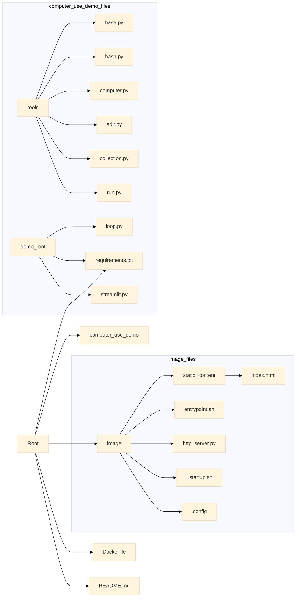

<p align="center">
  
  <h1 align="center">🌟 Anthropic Computer Use Demo 🌟</h1>
</p>

<p align="center">
  <a href="https://github.com/anthropics/computer-use-demo">
    
  </a>
  <a href="https://github.com/anthropics/computer-use-demo/blob/main/LICENSE">
    
  </a>
  <a href="https://github.com/anthropics/computer-use-demo/stargazers">
    
  </a>
</p>

<h2 align="center">
  ～ Claude 3.5 Sonnetのコンピューター使用機能デモ ～

<a href="https://github.com/anthropics/computer-use-demo/blob/main/README.md"></a>
<a href="https://github.com/anthropics/computer-use-demo/blob/main/docs/README.en.md"></a>
</h2>

<p align="center">
  
  
  
  
</p>

>  [!CAUTION]
> Computer useは現在ベータ機能です。Computer useは、標準的なAPIやチャットインターフェースとは異なる固有のリスクがあることにご注意ください。特にインターネットとの対話を行う場合、これらのリスクは高まります。リスクを最小限に抑えるため、以下のような予防措置を検討してください：
>
> 1. システムへの直接的な攻撃や事故を防ぐため、最小限の権限を持つ専用の仮想マシンまたはコンテナを使用する
> 2. 情報漏洩を防ぐため、アカウントのログイン情報などの機密データへのアクセスを制限する
> 3. 悪意のあるコンテンツへの露出を減らすため、許可リストに登録されたドメインのみにインターネットアクセスを制限する
> 4. クッキーの承認、金融取引、利用規約への同意など、実世界で重要な結果をもたらす可能性のある決定や、明示的な同意を必要とするタスクについては、人間による確認を求める
>
> 場合によっては、Claudeはユーザーの指示と矛盾する内容であっても、コンテンツ内のコマンドに従う可能性があります。例えば、ウェブページや画像に含まれる指示がユーザーの指示を上書きしたり、Claudeにエラーを引き起こす可能性があります。プロンプトインジェクションに関連するリスクを避けるため、機密データやアクションからClaudeを隔離することをお勧めします。
>
> 最後に、自社製品でcomputer useを有効にする前に、エンドユーザーに関連するリスクを通知し、同意を得てください。

このリポジトリは、Claudeのcomputer useを開始するための以下の参照実装を提供します：

* 必要な依存関係を含むDockerコンテナを作成するためのビルドファイル
* Anthropic API、Bedrock、またはVertexを使用してClaude 3.5 Sonnetモデルにアクセスするcomputer useエージェントループ
* Anthropicが定義したcomputer useツール
* エージェントループと対話するためのStreamlitアプリ

モデルの応答品質、API自体、またはドキュメントの品質についてのフィードバックは[このフォーム](https://forms.gle/BT1hpBrqDPDUrCqo7)からお寄せください。

> [!IMPORTANT]
> この参照実装で使用されているベータAPIは変更される可能性があります。最新の情報については[APIリリースノート](https://docs.anthropic.com/en/release-notes/api)を参照してください。

> [!IMPORTANT]
> コンポーネントは緩やかに分離されています：エージェントループはClaudeによって制御されるコンテナ内で実行され、一度に1つのセッションでのみ使用でき、必要に応じてセッション間で再起動またはリセットする必要があります。

## 🚀 クイックスタート：Dockerコンテナの実行

### 🔑 Anthropic API

> [!TIP]
> APIキーは[Anthropic Console](https://console.anthropic.com/)で確認できます。

```bash
export ANTHROPIC_API_KEY=%your_api_key%
docker run \
    -e ANTHROPIC_API_KEY=$ANTHROPIC_API_KEY \
    -v $HOME/.anthropic:/home/computeruse/.anthropic \
    -p 5900:5900 \
    -p 8501:8501 \
    -p 6080:6080 \
    -p 8080:8080 \
    -it ghcr.io/anthropics/anthropic-quickstarts:computer-use-demo-latest
```

コンテナが起動したら、インターフェースへの接続方法については下記の[デモアプリへのアクセス](#デモアプリへのアクセス)セクションを参照してください。

### ☁️ Bedrock

BedrockでClaudeを使用するには、適切な権限を持つAWS認証情報を渡す必要があります。

Bedrockでの認証には複数のオプションがあります。詳細とオプションについては[boto3のドキュメント](https://boto3.amazonaws.com/v1/documentation/api/latest/guide/credentials.html#environment-variables)を参照してください。

#### ➡️ オプション1：（推奨）ホストのAWS認証情報ファイルとAWSプロファイルを使用

```bash
export AWS_PROFILE=<your_aws_profile>
docker run \
    -e API_PROVIDER=bedrock \
    -e AWS_PROFILE=$AWS_PROFILE \
    -e AWS_REGION=us-west-2 \
    -v $HOME/.aws/credentials:/home/computeruse/.aws/credentials \
    -v $HOME/.anthropic:/home/computeruse/.anthropic \
    -p 5900:5900 \
    -p 8501:8501 \
    -p 6080:6080 \
    -p 8080:8080 \
    -it ghcr.io/anthropics/anthropic-quickstarts:computer-use-demo-latest
```

コンテナが起動したら、インターフェースへの接続方法については下記の[デモアプリへのアクセス](#デモアプリへのアクセス)セクションを参照してください。

#### ➡️ オプション2：アクセスキーとシークレットを使用

```bash
export AWS_ACCESS_KEY_ID=%your_aws_access_key%
export AWS_SECRET_ACCESS_KEY=%your_aws_secret_access_key%
export AWS_SESSION_TOKEN=%your_aws_session_token%
docker run \
    -e API_PROVIDER=bedrock \
    -e AWS_ACCESS_KEY_ID=$AWS_ACCESS_KEY_ID \
    -e AWS_SECRET_ACCESS_KEY=$AWS_SECRET_ACCESS_KEY \
    -e AWS_SESSION_TOKEN=$AWS_SESSION_TOKEN \
    -e AWS_REGION=us-west-2 \
    -v $HOME/.anthropic:/home/computeruse/.anthropic \
    -p 5900:5900 \
    -p 8501:8501 \
    -p 6080:6080 \
    -p 8080:8080 \
    -it ghcr.io/anthropics/anthropic-quickstarts:computer-use-demo-latest
```

コンテナが起動したら、インターフェースへの接続方法については下記の[デモアプリへのアクセス](#デモアプリへのアクセス)セクションを参照してください。

### 🟢 Vertex

VertexでClaudeを使用するには、適切な権限を持つGoogle Cloud認証情報を渡す必要があります。

```bash
docker build . -t computer-use-demo
gcloud auth application-default login
export VERTEX_REGION=%your_vertex_region%
export VERTEX_PROJECT_ID=%your_vertex_project_id%
docker run \
    -e API_PROVIDER=vertex \
    -e CLOUD_ML_REGION=$VERTEX_REGION \
    -e ANTHROPIC_VERTEX_PROJECT_ID=$VERTEX_PROJECT_ID \
    -v $HOME/.config/gcloud/application_default_credentials.json:/home/computeruse/.config/gcloud/application_default_credentials.json \
    -p 5900:5900 \
    -p 8501:8501 \
    -p 6080:6080 \
    -p 8080:8080 \
    -it computer-use-demo
```

コンテナが起動したら、インターフェースへの接続方法については下記の[デモアプリへのアクセス](#デモアプリへのアクセス)セクションを参照してください。

この例では、VertexでのGoogle Cloud Application Default Credentialsを使用した認証方法を示しています。

任意の認証情報ファイルを使用するために`GOOGLE_APPLICATION_CREDENTIALS`を設定することもできます。詳細については[Google Cloud認証ドキュメント](https://cloud.google.com/docs/authentication/application-default-credentials#GAC)を参照してください。

### 🖥️ デモアプリへのアクセス

コンテナが起動したら、ブラウザで[http://localhost:8080](http://localhost:8080)を開いて、エージェントチャットとデスクトップビューの両方を含む統合インターフェースにアクセスできます。

コンテナはAPIキーやカスタムシステムプロンプトなどの設定を`~/.anthropic/`に保存します。これらの設定をコンテナの実行間で保持するには、このディレクトリをマウントしてください。

その他のアクセスポイント：

- Streamlitインターフェースのみ：[http://localhost:8501](http://localhost:8501)
- デスクトップビューのみ：[http://localhost:6080/vnc.html](http://localhost:6080/vnc.html)
- 直接VNC接続：`vnc://localhost:5900`（VNCクライアント用）

## 📏 画面サイズ

環境変数`WIDTH`と`HEIGHT`を使用して画面サイズを設定できます。例：

```bash
docker run \
    -e ANTHROPIC_API_KEY=$ANTHROPIC_API_KEY \
    -v $HOME/.anthropic:/home/computeruse/.anthropic \
    -p 5900:5900 \
    -p 8501:8501 \
    -p 6080:6080 \
    -p 8080:8080 \
    -e WIDTH=1920 \
    -e HEIGHT=1080 \
    -it ghcr.io/anthropics/anthropic-quickstarts:computer-use-demo-latest
```

[画像のリサイズ](https://docs.anthropic.com/en/docs/build-with-claude/vision#evaluate-image-size)に関する問題を避けるため、[XGA/WXGA](https://en.wikipedia.org/wiki/Display_resolution_standards#XGA)以上の解像度でのスクリーンショット送信はお勧めしません。
APIの画像リサイズ動作に依存すると、ツールで直接スケーリングを実装する場合と比べて、モデルの精度が低下しパフォーマンスが遅くなります。このプロジェクトの`computer`ツール実装では、より高い解像度から推奨解像度への画像とコーディネートのスケーリング方法を示しています。

## 🛠️ 開発

```bash
./setup.sh  # venvの設定、開発依存関係のインストール、pre-commitフックのインストール
docker build . -t computer-use-demo:local  # Dockerイメージを手動でビルド（オプション）
export ANTHROPIC_API_KEY=%your_api_key%
docker run \
    -e ANTHROPIC_API_KEY=$ANTHROPIC_API_KEY \
    -v $(pwd)/computer_use_demo:/home/computeruse/computer_use_demo/ # 開発用にローカルのPythonモジュールをマウント \
    -v $HOME/.anthropic:/home/computeruse/.anthropic \
    -p 5900:5900 \
    -p 8501:8501 \
    -p 6080:6080 \
    -p 8080:8080 \
    -it computer-use-demo:local  # ghcr.io/anthropics/anthropic-quickstarts:computer-use-demo-latestも使用可能
```

```powershell
# Dockerイメージを手動でビルド（オプション）
docker build . -t computer-use-demo:local

# 環境変数の設定
$env:ANTHROPIC_API_KEY = "your_api_key"

# Dockerコンテナの実行
docker run `
    -e ANTHROPIC_API_KEY=$env:ANTHROPIC_API_KEY `
    -v ${PWD}/computer_use_demo:/home/computeruse/computer_use_demo/ `
    -v ${HOME}/.anthropic:/home/computeruse/.anthropic `
    -p 5900:5900 `
    -p 8501:8501 `
    -p 6080:6080 `
    -p 8080:8080 `
    -it computer-use-demo:local
```

上記のdocker runコマンドは、ホストから編集できるようにリポジトリをDockerイメージ内にマウントします。Streamlitは自動リロードが既に設定されています。

## 📂 リポジトリの詳細構造

以下に、主要なディレクトリとファイルの役割を詳しく説明します。

### 🗄️ 主要ディレクトリ

* **`computer_use_demo/`**: AIエージェントの頭脳を構成するPythonコードの中核部分。
    * **`tools/`**: AIエージェントが使用するツール群を実装。`bash.py` (bashコマンド実行), `computer.py` (画面/キーボード/マウス操作), `edit.py` (ファイル編集)など、各ツールは特定の機能を提供します。`base.py`はツールの基底クラスを定義し、`collection.py`はツール群を一括管理します。`run.py`はシェルコマンドの非同期実行ユーティリティを提供します。
    * `loop.py`: AIエージェントとの対話ループを実装。API呼び出し、ツールの実行、結果の処理などを繰り返すことで、AIエージェントが自律的に動作します。
    * `requirements.txt`: デモ実行に必要なPythonパッケージをリストアップします。
    * `streamlit.py`: Streamlitアプリのエントリポイント。ユーザーインターフェースを提供し、チャット画面、API通信ログ表示、設定パネルなどを表示します。
* **`image/`**: Dockerイメージ構築に必要なファイル群。仮想環境の設計図と言えるでしょう。
    * `static_content/`: HTTPサーバーが提供するHTML, JavaScript等の静的コンテンツ。StreamlitアプリとnoVNCを統合したインターフェースを提供します。
    * `entrypoint.sh`: Dockerコンテナ起動時に実行されるスクリプト。各種サービスの起動とログの設定などを行います。
    * `http_server.py`: StreamlitとnoVNCへのアクセスを統合するシンプルなHTTPサーバー。
    * `*.startup.sh`: Xvfb (仮想ディスプレイ), tint2 (パネル), mutter (ウィンドウマネージャ), x11vnc (VNCサーバー), noVNC (HTML5 VNCクライアント) などの起動スクリプト。
    * `.config/`: tint2の設定ファイル等。

### 📄 その他のファイル

* `.env.example`: 環境変数の設定例。APIキーや各種トークンの設定に使用します。
* `app.py`: シンプルなStreamlitアプリでREADME.mdの内容を表示します。
* `dev-requirements.txt`: 開発環境に必要なパッケージ一覧。
* `Dockerfile`: Dockerイメージの構築方法を定義。Ubuntuベースのイメージに必要ツールやライブラリをインストールし、ユーザー、Python環境、デスクトップ環境をセットアップします。
* `LICENSE copy`: ライセンス情報。
* `pyproject.toml`: プロジェクト設定ファイル。Pyrightとpytestの設定が含まれています。
* `README.md`: プロジェクトの説明ドキュメント。
* `requirements.txt`: 実行に必要なPythonパッケージ一覧。
* `ruff.toml`: Ruff (Pythonのlinter) の設定ファイル。
* `setup.ps1`, `setup.sh`: 開発環境のセットアップスクリプト。Windows (PowerShell) とLinux/macOS (bash) に対応しています。


### 📊 リポジトリ構造の可視化


