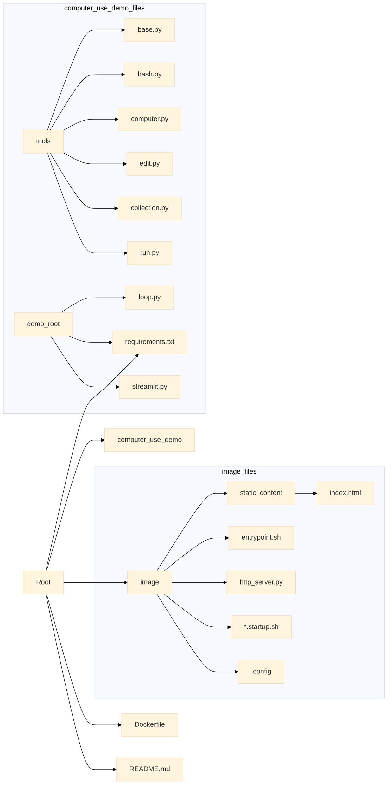

<p align="center">
  
  <h1 align="center">🌟 Anthropic Computer Use Demo (Japanese) 🌟</h1>
</p>

<p align="center">
  <a href="https://github.com/Sunwood-ai-labs/computer-use-demo-jp">
    
  </a>
  <a href="https://github.com/Sunwood-ai-labs/computer-use-demo-jp/blob/main/LICENSE%20copy">
    
  </a>
  <a href="https://github.com/Sunwood-ai-labs/computer-use-demo-jp/stargazers">
    
  </a>
</p>

<h2 align="center">
  ～ Claude 3.5 Sonnet Computer Use Demo ～

<a href="https://github.com/Sunwood-ai-labs/computer-use-demo-jp/blob/main/README.md"></a>
<a href="https://github.com/Sunwood-ai-labs/computer-use-demo-jp/blob/main/docs/README.en.md"></a>
</h2>

<p align="center">
  
  
  
  
</p>

> [!CAUTION]
> Computer use is currently a beta feature. Please be aware that Computer use carries inherent risks that differ from standard APIs and chat interfaces. These risks are heightened when interacting with the internet. To minimize risks, consider the following precautions:
>
> 1. Use a dedicated virtual machine or container with minimal privileges to prevent direct attacks or accidents on your system.
> 2. Restrict access to sensitive data, such as account login information, to prevent data leaks.
> 3. Restrict internet access to only whitelisted domains to reduce exposure to malicious content.
> 4. Seek human verification for decisions that could have significant real-world consequences, such as cookie approvals, financial transactions, and acceptance of terms of service, or tasks requiring explicit consent.
>
> In some cases, Claude may follow commands within content even if they contradict user instructions. For example, instructions embedded in web pages or images may override user instructions or cause errors in Claude. To avoid risks associated with prompt injection, it is recommended to isolate Claude from sensitive data and actions.
>
> Finally, before enabling computer use in your product, notify and obtain consent from end-users regarding the associated risks.

This repository provides the following reference implementation for getting started with Claude's computer use:

* Build files to create a Docker container with the necessary dependencies.
* A computer use agent loop that accesses the Claude 3.5 Sonnet model using the Anthropic API, Bedrock, or Vertex.
* Anthropic-defined computer use tools.
* A Streamlit app for interacting with the agent loop.

For feedback on model response quality, the API itself, or the quality of the documentation, please use [this form](https://forms.gle/BT1hpBrqDPDUrCqo7).

> [!IMPORTANT]
> The beta APIs used in this reference implementation are subject to change. Please refer to the [API release notes](https://docs.anthropic.com/en/release-notes/api) for the latest information.

> [!IMPORTANT]
> Components are loosely coupled: the agent loop runs within a container controlled by Claude, usable only in one session at a time, needing to be restarted or reset between sessions as needed.

## 🚀 Quickstart: Running the Docker Container

### 🔑 Running with Anthropic API Key

> [!TIP]
> Your API key can be found in the [Anthropic Console](https://console.anthropic.com/).

```bash
export ANTHROPIC_API_KEY=%your_api_key%
docker compose up -d
```

Once the container is started, see the [Accessing the Demo App](#Accessing-the-Demo-App) section below for instructions on connecting to the interface.


### 🖥️ Accessing the Demo App

Once the container is running, open [http://localhost:8080](http://localhost:8080) in your browser to access an integrated interface including both the agent chat and desktop view.

The container saves settings such as the API key and custom system prompt to `~/.anthropic/`. To persist these settings between container runs, mount this directory.

Other access points:

- Streamlit interface only: [http://localhost:8501](http://localhost:8501)
- Desktop view only: [http://localhost:6080/vnc.html](http://localhost:6080/vnc.html)
- Direct VNC connection: `vnc://localhost:5900` (for VNC clients)

## 📏 Screen Size

You can set the screen size using the environment variables `WIDTH` and `HEIGHT`. Example:

```bash
export WIDTH=1920
export HEIGHT=1080
docker compose up -d
```

To avoid problems with [image resizing](https://docs.anthropic.com/en/docs/build-with-claude/vision#evaluate-image-size), sending screenshots with resolutions higher than [XGA/WXGA](https://en.wikipedia.org/wiki/Display_resolution_standards#XGA) is not recommended.  Relying on the API's image resizing behavior will lead to lower model accuracy and slower performance compared to implementing scaling directly in the tool.  This project's `computer` tool implementation shows how to scale images and coordinates from higher resolutions down to the recommended resolution.

## 🛠️ Development Environment

```bash
./setup.sh  # Sets up venv, installs development dependencies, and installs pre-commit hooks
docker build . -t computer-use-demo:local  # Manually build Docker image (optional)
export ANTHROPIC_API_KEY=%your_api_key%
docker compose up -d
```

```powershell
# Manually build Docker image (optional)
docker build . -t computer-use-demo:local

# Set environment variables
$env:ANTHROPIC_API_KEY = "your_api_key"

# Run Docker container
docker compose up -d
```

The above docker run command mounts the repository inside the docker image, allowing editing from the host. Streamlit auto-reload is already configured.

## 📂 Repository Structure Details

Below is a detailed explanation of the roles of the main directories and files.

### 🗄️ Main Directories

* **`computer_use_demo/`**: The core Python code that constitutes the brain of the AI agent.
    * **`tools/`**: Implements the set of tools used by the AI agent.  `bash.py` (executes bash commands), `computer.py` (screen/keyboard/mouse control), `edit.py` (file editing), etc., each tool provides a specific function. `base.py` defines the base class for tools, and `collection.py` manages the tool set collectively. `run.py` provides asynchronous shell command execution utility.
    * `loop.py`: Implements the interaction loop with the AI agent.  It repeatedly calls the API, executes tools, and processes results, allowing the AI agent to operate autonomously.
    * `requirements.txt`: Lists the Python packages required for demo execution.
    * `streamlit.py`: The entry point for the Streamlit app. Provides a user interface and displays the chat screen, API communication logs, and settings panel.
* **`image/`**:  Files necessary for building the Docker image.  Consider it the blueprint for the virtual environment.
    * `static_content/`: Static content such as HTML and JavaScript served by the HTTP server. Provides an integrated interface combining the Streamlit app and noVNC.
    * `entrypoint.sh`: Script executed when the Docker container starts.  Performs tasks such as starting various services and configuring logs.
    * `http_server.py`: A simple HTTP server that integrates access to Streamlit and noVNC.
    * `*.startup.sh`: Startup scripts for Xvfb (virtual display), tint2 (panel), mutter (window manager), x11vnc (VNC server), noVNC (HTML5 VNC client), etc.
    * `.config/`: Configuration files for tint2, etc.

### 📄 Other Files

* `.env.example`: Example environment variable settings. Used for setting API keys and various tokens.
* `app.py`: A simple Streamlit app that displays the contents of README.md.
* `dev-requirements.txt`: List of packages required for the development environment.
* `Dockerfile`: Defines how to build the Docker image. Installs necessary tools and libraries on an Ubuntu-based image and sets up the user, Python environment, and desktop environment.
* `LICENSE copy`: License information.
* `pyproject.toml`: Project configuration file. Includes Pyright and pytest settings.
* `README.md`: Project description document.
* `requirements.txt`: List of Python packages required for execution.
* `ruff.toml`: Configuration file for Ruff (Python linter).
* `setup.ps1`, `setup.sh`: Development environment setup scripts. Supports Windows (PowerShell) and Linux/macOS (bash).


### 📊 Visualization of Repository Structure



## 📄 License

📄 MIT License

## 👏 Acknowledgements

iris-s-coon, Maki