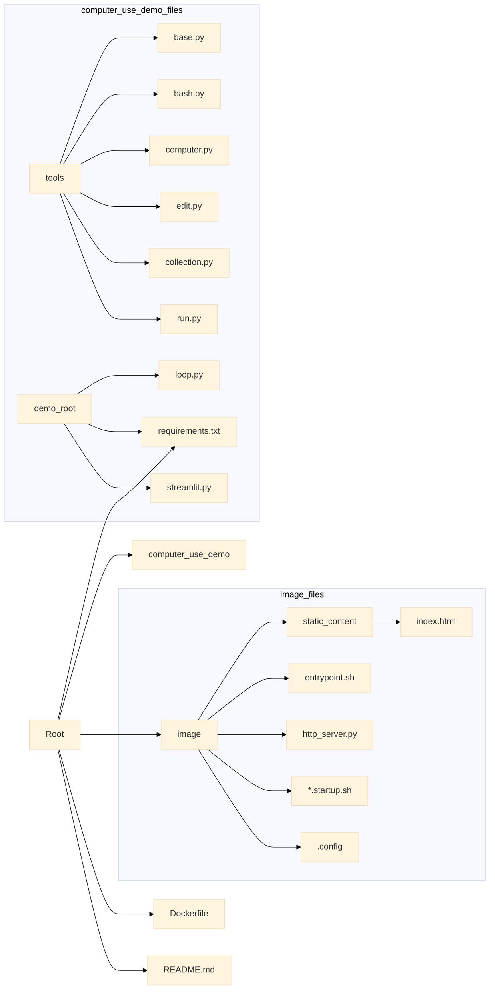

## 🌟 Anthropic Computer Use Demo 🌟

<p align="center">
  
</p>

<p align="center">
  <a href="https://github.com/anthropics/computer-use-demo">
    
  </a>
  <a href="https://github.com/anthropics/computer-use-demo/blob/main/LICENSE">
    
  </a>
  <a href="https://github.com/anthropics/computer-use-demo/stargazers">
    
  </a>
</p>

<h2 align="center">
  ～ Claude 3.5 Sonnet Computer Use Demo ～

<a href="https://github.com/anthropics/computer-use-demo/blob/main/README.md"></a>
<a href="https://github.com/anthropics/computer-use-demo/blob/main/docs/README.en.md"></a>
</h2>

<p align="center">
  
  
  
  
</p>

> **[!CAUTION] CAUTION:** Computer use is currently a beta feature.  Be aware that computer use presents unique risks distinct from standard APIs or chat interfaces. These risks are particularly heightened when interacting with the internet. To minimize risks, consider the following precautions:

> 1. Use a dedicated virtual machine or container with minimal privileges to prevent direct attacks or accidents on your system.
> 2. Restrict access to sensitive data, such as account login credentials, to prevent information leakage.
> 3. Limit internet access to an allowlist of domains to reduce exposure to malicious content.
> 4. Seek human confirmation for decisions that could have significant real-world consequences (e.g., cookie acceptance, financial transactions, accepting terms of service) or tasks requiring explicit consent.

> In some cases, Claude may follow commands within content even if they contradict the user's instructions. For example, instructions embedded in web pages or images could override user instructions or cause errors in Claude. To mitigate risks associated with prompt injection, we recommend isolating Claude from sensitive data and actions.

> Finally, before enabling computer use in your product, notify and obtain consent from your end-users regarding the associated risks.


This repository provides the following reference implementation for getting started with Claude's computer use:

* Build files for creating a Docker container with the necessary dependencies.
* A computer use agent loop that accesses the Claude 3.5 Sonnet model using the Anthropic API, Bedrock, or Vertex.
* Anthropic-defined computer use tools.
* A Streamlit app for interacting with the agent loop.

Please provide feedback on model response quality, the API itself, or the quality of the documentation via [this form](https://forms.gle/BT1hpBrqDPDUrCqo7).

> **[!IMPORTANT] IMPORTANT:** The beta API used in this reference implementation is subject to change.  Refer to the [API release notes](https://docs.anthropic.com/en/release-notes/api) for the latest information.

> **[!IMPORTANT] IMPORTANT:** Components are loosely coupled: the agent loop runs inside a container controlled by Claude, can only be used in one session at a time, and needs to be restarted or reset between sessions as needed.


## 🚀 Quick Start: Running the Docker Container

### 🔑 Anthropic API

> **[!TIP] TIP:** Your API key can be found in the [Anthropic Console](https://console.anthropic.com/).

```bash
export ANTHROPIC_API_KEY=%your_api_key%
docker run \
    -e ANTHROPIC_API_KEY=$ANTHROPIC_API_KEY \
    -v $HOME/.anthropic:/home/computeruse/.anthropic \
    -p 5900:5900 \
    -p 8501:8501 \
    -p 6080:6080 \
    -p 8080:8080 \
    -it ghcr.io/anthropics/anthropic-quickstarts:computer-use-demo-latest
```

Once the container is running, see the [Accessing the Demo App](#accessing-the-demo-app) section below for instructions on how to connect to the interface.


### ☁️ Bedrock

To use Claude with Bedrock, you need to provide AWS credentials with appropriate permissions.

There are multiple options for authenticating with Bedrock.  See the [boto3 documentation](https://boto3.amazonaws.com/v1/documentation/api/latest/guide/credentials.html#environment-variables) for details and options.

#### ➡️ Option 1: (Recommended) Using host AWS credentials file and AWS profile

```bash
export AWS_PROFILE=<your_aws_profile>
docker run \
    -e API_PROVIDER=bedrock \
    -e AWS_PROFILE=$AWS_PROFILE \
    -e AWS_REGION=us-west-2 \
    -v $HOME/.aws/credentials:/home/computeruse/.aws/credentials \
    -v $HOME/.anthropic:/home/computeruse/.anthropic \
    -p 5900:5900 \
    -p 8501:8501 \
    -p 6080:6080 \
    -p 8080:8080 \
    -it ghcr.io/anthropics/anthropic-quickstarts:computer-use-demo-latest
```

Once the container is running, see the [Accessing the Demo App](#accessing-the-demo-app) section below for instructions on how to connect to the interface.

#### ➡️ Option 2: Using access key and secret

```bash
export AWS_ACCESS_KEY_ID=%your_aws_access_key%
export AWS_SECRET_ACCESS_KEY=%your_aws_secret_access_key%
export AWS_SESSION_TOKEN=%your_aws_session_token%
docker run \
    -e API_PROVIDER=bedrock \
    -e AWS_ACCESS_KEY_ID=$AWS_ACCESS_KEY_ID \
    -e AWS_SECRET_ACCESS_KEY=$AWS_SECRET_ACCESS_KEY \
    -e AWS_SESSION_TOKEN=$AWS_SESSION_TOKEN \
    -e AWS_REGION=us-west-2 \
    -v $HOME/.anthropic:/home/computeruse/.anthropic \
    -p 5900:5900 \
    -p 8501:8501 \
    -p 6080:6080 \
    -p 8080:8080 \
    -it ghcr.io/anthropics/anthropic-quickstarts:computer-use-demo-latest
```

Once the container is running, see the [Accessing the Demo App](#accessing-the-demo-app) section below for instructions on how to connect to the interface.


### 🟢 Vertex

To use Claude with Vertex, you need to provide Google Cloud credentials with appropriate permissions.

```bash
docker build . -t computer-use-demo
gcloud auth application-default login
export VERTEX_REGION=%your_vertex_region%
export VERTEX_PROJECT_ID=%your_vertex_project_id%
docker run \
    -e API_PROVIDER=vertex \
    -e CLOUD_ML_REGION=$VERTEX_REGION \
    -e ANTHROPIC_VERTEX_PROJECT_ID=$VERTEX_PROJECT_ID \
    -v $HOME/.config/gcloud/application_default_credentials.json:/home/computeruse/.config/gcloud/application_default_credentials.json \
    -p 5900:5900 \
    -p 8501:8501 \
    -p 6080:6080 \
    -p 8080:8080 \
    -it computer-use-demo
```

Once the container is running, see the [Accessing the Demo App](#accessing-the-demo-app) section below for instructions on how to connect to the interface.

This example shows authentication using Google Cloud Application Default Credentials with Vertex.

You can also set `GOOGLE_APPLICATION_CREDENTIALS` to use an arbitrary credentials file. See the [Google Cloud authentication documentation](https://cloud.google.com/docs/authentication/application-default-credentials#GAC) for details.


### 🖥️ Accessing the Demo App

Once the container is running, open [http://localhost:8080](http://localhost:8080) in your browser to access the integrated interface including both the agent chat and desktop view.

The container saves settings such as API keys and custom system prompts to `~/.anthropic/`. To persist these settings between container runs, mount this directory.

Other access points:

- Streamlit interface only: [http://localhost:8501](http://localhost:8501)
- Desktop view only: [http://localhost:6080/vnc.html](http://localhost:6080/vnc.html)
- Direct VNC connection: `vnc://localhost:5900` (for VNC clients)


## 📏 Screen Size

You can set the screen size using the environment variables `WIDTH` and `HEIGHT`. Example:

```bash
docker run \
    -e ANTHROPIC_API_KEY=$ANTHROPIC_API_KEY \
    -v $HOME/.anthropic:/home/computeruse/.anthropic \
    -p 5900:5900 \
    -p 8501:8501 \
    -p 6080:6080 \
    -p 8080:8080 \
    -e WIDTH=1920 \
    -e HEIGHT=1080 \
    -it ghcr.io/anthropics/anthropic-quickstarts:computer-use-demo-latest
```

To avoid issues with [image resizing](https://docs.anthropic.com/en/docs/build-with-claude/vision#evaluate-image-size), we recommend sending screenshots at a resolution of [XGA/WXGA](https://en.wikipedia.org/wiki/Display_resolution_standards#XGA) or higher. Relying on the API's image resizing behavior will result in lower model accuracy and slower performance compared to implementing scaling directly in the tool. The `computer` tool implementation in this project demonstrates a method for scaling images and coordinates from higher resolutions down to the recommended resolution.


## 🛠️ Development

```bash
./setup.sh  # Sets up venv, installs development dependencies, and installs pre-commit hooks.
docker build . -t computer-use-demo:local  # Manually build the Docker image (optional)
export ANTHROPIC_API_KEY=%your_api_key%
docker run \
    -e ANTHROPIC_API_KEY=$ANTHROPIC_API_KEY \
    -v $(pwd)/computer_use_demo:/home/computeruse/computer_use_demo/ # Mounts local Python modules for development
    -v $HOME/.anthropic:/home/computeruse/.anthropic \
    -p 5900:5900 \
    -p 8501:8501 \
    -p 6080:6080 \
    -p 8080:8080 \
    -it computer-use-demo:local  # You can also use ghcr.io/anthropics/anthropic-quickstarts:computer-use-demo-latest
```

```powershell
# Manually build the Docker image (optional)
docker build . -t computer-use-demo:local

# Set environment variables
$env:ANTHROPIC_API_KEY = "your_api_key"

# Run the Docker container
docker run `
    -e ANTHROPIC_API_KEY=$env:ANTHROPIC_API_KEY `
    -v ${PWD}/computer_use_demo:/home/computeruse/computer_use_demo/ `
    -v ${HOME}/.anthropic:/home/computeruse/.anthropic `
    -p 5900:5900 `
    -p 8501:8501 `
    -p 6080:6080 `
    -p 8080:8080 `
    -it computer-use-demo:local
```

The `docker run` command above mounts the repository into the Docker image so it can be edited from the host. Streamlit already has auto-reload configured.


## 📂 Repository Structure Details

Below is a detailed explanation of the roles of the main directories and files.

### 🗄️ Main Directories

* **`computer_use_demo/`**: The core of the Python code that makes up the brain of the AI agent.
    * **`tools/`**: Implements the set of tools used by the AI agent.  `bash.py` (executes bash commands), `computer.py` (screen/keyboard/mouse operations), `edit.py` (file editing), etc., each tool provides a specific function. `base.py` defines the base class for tools, and `collection.py` manages the set of tools as a whole. `run.py` provides a utility for asynchronous execution of shell commands.
    * `loop.py`: Implements the interaction loop with the AI agent.  It repeatedly calls the API, executes tools, and processes results, allowing the AI agent to operate autonomously.
    * `requirements.txt`: Lists the Python packages required for demo execution.
    * `streamlit.py`: The entry point for the Streamlit app.  Provides a user interface showing the chat screen, API communication log display, settings panel, etc.
* **`image/`**: Contains the files necessary for building the Docker image.  It can be considered the blueprint for the virtual environment.
    * `static_content/`: Static content such as HTML and JavaScript served by the HTTP server.  Provides an interface that integrates the Streamlit app and noVNC.
    * `entrypoint.sh`: The script executed when the Docker container starts.  Performs tasks such as starting various services and configuring logs.
    * `http_server.py`: A simple HTTP server that integrates access to Streamlit and noVNC.
    * `*.startup.sh`: Startup scripts for Xvfb (virtual display), tint2 (panel), mutter (window manager), x11vnc (VNC server), noVNC (HTML5 VNC client), etc.
    * `.config/`: Configuration files for tint2, etc.


### 📄 Other Files

* `.env.example`: Example environment variable settings.  Used for setting API keys and various tokens.
* `app.py`: A simple Streamlit app that displays the contents of README.md.
* `dev-requirements.txt`: List of packages required for the development environment.
* `Dockerfile`: Defines how to build the Docker image.  Installs necessary tools and libraries on an Ubuntu-based image and sets up the user, Python environment, and desktop environment.
* `LICENSE`: License information.
* `pyproject.toml`: Project configuration file. Contains Pyright and pytest settings.
* `README.md`: Project description document.
* `requirements.txt`: List of Python packages required for execution.
* `ruff.toml`: Configuration file for Ruff (a Python linter).
* `setup.ps1`, `setup.sh`: Development environment setup scripts.  Supports Windows (PowerShell) and Linux/macOS (bash).


### 📊 Visualization of Repository Structure

